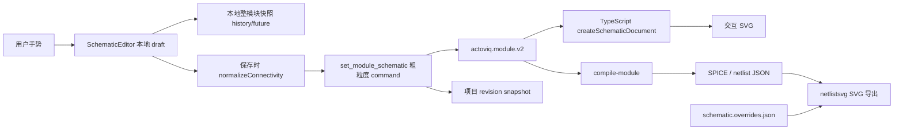
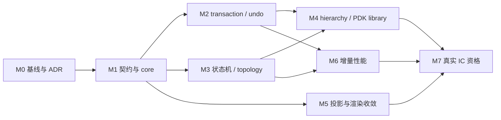

# Actoviq 原理图编辑交互缺口、架构重构与 IC 规划落地计划

> 状态：M0–M6 已完成并通过最新代码的功能、性能、GUI 与视觉验证；M7 的本地资格契约和发布门禁已完成，但 native Linux/IHP 与商业持牌黄金链尚未执行，不能标记为完整完成（2026-07-30）
> 完成审计基线：`9bdbb6e`

## 执行结果（2026-07-30）

- M0–M2：基线、schema/core、command v2、持久化 undo/revision/lease 已闭合；补漏提交 `e22096a`。
- M3：专业编辑交互与拓扑已闭合；阶段提交 `0663621` 至 `5b38f7f`。
- M4：层次导航、PDK 器件库、项目搜索和探针映射已闭合；阶段提交 `506af51`、`2b630b6`、`f7e945c`。
- M5：共享投影、render map、20 fixture parity 和 legacy override 隔离已闭合；阶段提交 `fc125f6`、`48bd2c3`；旧 `createSchematicDocument` 已改为委托 facade，兼容实现下沉到独立文件（`6e9f046`）。
- M6：worker 投影、懒加载、affected-module compile、20/500/5,000 基准和大图建议已闭合；阶段提交 `abbc4e9`；属性/模块元数据已走安全增量投影和增量 ERC，几何/拓扑变化保留完整回退（`e2daf59`）。
- M7：固定环境/PDK 锁、真实项目证据 schema、hash/波形/Xschem/商业边界校验和发布门禁已闭合；阶段提交 `987749f`。真实 native/商业 qualification 仍属于外部待资格，不得以 fixture 或 WSL 结果代替。
- M7 补充审查修复：资格报告现在把同机 tool record、provider 版本/可执行文件、左右仿真 run ID、profile、revision、document hash 和实际比较 metric 互相绑定，并拒绝不合格 tool record、缺波形、未关联 run 和 provider 版本漂移（`c3edb9b`）；self-hosted workflow 在安装依赖和运行发布套件前执行无绝对路径泄露的 native/IHP/8 项证据 preflight（`9bdbb6e`）。
- 补充审查修复：大图性能基准改为真实 Space+drag 平移（`1edff91`）；Agent manual policy 增加持久化待审 transaction 的接受/拒绝/陈旧保护（`9d45763`）；应用壳层改用不可滚动的裁切容器，修复聚焦右侧工具后工作台左边缘被裁切，并增加视觉边界断言（`ce97b51`）。
- 补充全功能审计发现并修复两个既有缺陷：编译端子网络与受控源/行为源表达式命名不一致（`277620b`）；ReAct 迁移后技术报告工具未注册且旧 Agent Flow E2E 仍使用废弃响应协议（`d944ae4`）。
- 完整非 GUI 发布门禁 `npm run test:schematic-release` 通过；完整 GUI 发布门禁 `npm run test:schematic-release:gui` 通过，覆盖 move/free/stretch、snap/autowire、wire topology、connectivity selection、live ERC、cancel、hierarchy、PDK、投影兼容、Agent 待审、性能、综合编辑器和 Electron。
- 最新 GUI 修复后又单独通过 `npm run typecheck`、`npm run test:e2e:agent-flow` 和 `npm run test:e2e:electron`；Electron 系统窗口与 947×604 最小窗口均无文档横纵溢出。
- Agent Flow 实测完成 `create → context → apply → ERC → compile → simulate → technical report` 七工具闭环：revision 1、ERC 0 error、simulation success、`actoviq.technical-report.v1`，并通过视觉布局反馈循环。布局专用夹具有意省略地，项目级唯一错误被明确断言为 `missing_ground`，编辑器局部 Live ERC 为 0/0。
- 最新 100 元件 GUI 实测：首次可交互 `392.2 ms`、pan `266.8 ms`、zoom `63.4 ms`、drag preview p95 `0.8 ms`、增量属性投影 `101.4 ms`、保存 `1377.3 ms`、renderer heap `74.8 MB`。
- 最新 500 元件 GUI 实测：首次可交互 `552.4 ms`、pan `1146.1 ms`、zoom `160.6 ms`、drag preview p95 `1.4 ms`、增量属性投影 `360.9 ms`、保存 `2697.3 ms`、renderer heap `149.3 MB`。
- 当前主机只有 WSL2 Ubuntu 22.04（内核 `6.18.33.2-microsoft-standard-WSL2`），不是锁文件要求的 native Ubuntu 24.04。执行资格探针后得到 `native_eligible=false`、`wsl=true`，且 ngspice、Xyce、OpenVAF、Xschem 四个锁定工具全部缺失；因此未生成 `native_verified`。当前远端默认分支没有 `IC project native qualification` workflow，仓库级 self-hosted runner 查询结果为 `total_count=0`。商业 PDK/EDA 没有合法持牌运行环境，未执行。

### 完成度与证据矩阵

| 里程碑 | 当前状态 | 主要证据 |
|---|---|---|
| M0 基线与测试拆分 | 已完成 | 独立 Playwright scenes；真实 pan/zoom/drag/save/heap 基准；`1edff91` |
| M1 契约与纯 core | 已完成 | schema、command v2、纯 core、20 fixture parity；旧 API 委托 facade；`6e9f046` |
| M2 transaction/undo/conflict | 已完成 | 细粒度 operation、inverse/redo、revision/lease、Agent pending accept/reject/stale；`9d45763` |
| M3 交互状态机与拓扑 | 已完成 | move/stretch/free、snap/autowire、cut/split/join/trim/collapse、selection、live ERC、统一 cancel；GUI 发布门禁通过 |
| M4 hierarchy/PDK/probe | 已完成 | 三级导航、端口映射、revision mismatch、PDK browser/直接放置/参数验证、项目搜索、probe 映射；GUI 发布门禁通过 |
| M5 共享投影与兼容 | 已完成 | `schematic-document.v1`、render map、20/20 parity、netlistsvg compatibility、override migration；`6e9f046` |
| M6 大图性能 | 已完成 | 安全增量投影/ERC、worker、懒加载、affected compile、100/500 GUI 和 5,000 segment 基准；`e2daf59` |
| M7 本地资格契约/门禁 | 已完成 | 锁文件、qualification schema、同机工具/仿真证据绑定、preflight、开放/商业 provider 边界、`test:schematic-release`；`c3edb9b`、`9bdbb6e` |
| M7 native Linux/IHP 黄金链 | **外部阻塞，未执行** | WSL2 探针和 preflight 明确拒绝；缺 native Ubuntu 24.04、锁定 IHP revision 和四个工具；远端 workflow 尚不可见且 self-hosted runner 为 0 |
| M7 商业黄金链 | **外部阻塞，未执行** | 缺合法持牌 PDK/EDA 环境；不得由 mock/fixture 冒充 |

> 第 1–8 节保留 2026-07-28 的原始缺口分析和实施依据，其中的“部分完成/缺失”是历史基线；当前状态以本节矩阵为准。

### M7 剩余可执行步骤

1. 将当前分支合并到远端默认分支，使 `.github/workflows/ic-project-qualification.yml` 可见。
2. 注册带 `self-hosted, linux, ic-qualified` 标签的 **native Ubuntu 24.04** runner；当前仓库 runner 数量为 0，禁止 WSL/容器伪装 native。
3. 按 `.github/ic-qualification-lock.json` 安装并锁定 IHP SG13G2 revision `22f2a25f1734796de3debbbf29cf697cbbc54081`、ngspice、Xyce、OpenVAF、Xschem。
4. 在仓库变量中配置黄金项目、PDK scan、ERC、netlist、ngspice、Xyce、dual 和 Xschem 共 8 个证据路径；先取得 `preflight.status=ready`。
5. 调度 `IC project native qualification`，归档 project/module/PDK/tool/connectivity hash、双模拟波形、Xschem 比较和最终 report；只有报告签名满足契约后才更新为 `native_verified`。
6. 在合法持牌环境选择 Spectre、PrimeSim 或 AFS 中至少一个完成同一黄金设计；确认 PDK 不被复制、上传或打包后，单独记录商业资格。

> 基线日期：2026-07-28  
> 基线提交：`ac46e93fa374944e25bd731c652117d12497f4e8`  
> 关联规划：
> - `plan/electron-desktop-plan.md`
> - `plan/actoviq-ic-platform-implementation-plan.md`

## 1. 结论

Actoviq 当前不是“没有原理图编辑器”，而是已经具备一套功能较多、回归覆盖较好的编辑器原型：

- 已支持元件连续放置、旋转、框选、多选、复制/粘贴、拖拽、正交导线、导线点/段编辑、端口和地符号、参数表单、层次模块放置、缩放/平移/Fit。
- `actoviq.module.v2` 已是桌面手工编辑的主要结构化真源。
- `actoviq.schematic-document.v1` 已承担交互显示投影。
- `compile-module → netlist JSON → netlistsvg SVG` 的 AI/网表编译和导出链路仍然可用。
- PDK 注册、Xschem 三模式、开放/商业仿真 Provider、HDL、混合信号和物理验证的本地契约与回归均已存在。

主要问题是四条链路尚未合一：

1. **交互预览**由 `SchematicEditor.tsx` 内部状态和大量事件分支管理。
2. **编辑撤销**保存最多 40 份完整 `CircuitModule` 快照，保存后清空。
3. **项目持久化**把一次编辑会话压成一个粗粒度 `set_module_schematic` 操作。
4. **项目历史/恢复**又是独立的 revision snapshot。

这会导致：

- 保存前后的撤销语义不连续。
- 用户、Agent 和外部 Xschem 的变更无法在实体级比较和合并。
- 连接修复、导线重路由和 UI 手势耦合，新增交互越来越容易破坏旧行为。
- 交互投影与 netlistsvg 导出走两条实现路径，存在长期漂移风险。
- 编辑器核心文件已形成明显单体，继续直接堆功能的边际成本过高。

因此，近期优先级不应是增加更多零散工具，而应先完成：

1. 严格领域契约和统一投影边界。
2. 细粒度事务、持久化撤销和冲突模型。
3. 独立的交互状态机与连接拓扑引擎。
4. 层次导航和 IC/PDK 器件库工作流。
5. 保留现有编译链的前提下收敛渲染路径。

不建议推倒重写。应使用兼容适配器和现有 20 个拓扑 fixture、Playwright 场景逐段替换。

## 2. 调研范围与限制

### 2.1 本地代码

本次审计覆盖：

- 原理图编辑器与工具栏。
- `actoviq.module.v2`、`actoviq.command.v1` 和显示投影。
- 项目 command/revision 后端。
- netlistsvg 编译/渲染及 legacy override。
- 系统画布、模块画布和层次模块入口。
- PDK 器件目录与模拟 IC 参数表单。
- 原理图投影回归、编辑器 Playwright 和 IC 平台回归。

本项目要求优先使用 codebase-memory MCP 图工具；本次会话未暴露对应工具，因此代码发现退回到 `rg`、定点源码阅读和现有测试。

### 2.2 外部产品

- Qucs-S：审阅官方仓库 `ra3xdh/qucs_s` 的固定提交。
- Xschem：审阅官方仓库 `StefanSchippers/xschem` 的固定提交。
- LTspice：没有公开源码树，且为专有软件。本次只分析 Analog Devices 官方产品资料、快捷键和更新说明，不声称做过 LTspice 源码审计，也不进行反编译。

### 2.3 判断标准

“已有 UI 入口”与“工作流闭环”分开判断：

- **已完成**：数据契约、入口、执行和自动化验收都闭合。
- **部分完成**：主要对象存在，但交互、持久化或验收仍断裂。
- **缺失**：领域模型或用户工作流中没有对应能力。
- **外部待资格**：本地适配器已具备，但需要真实 Linux、PDK 或持牌环境。

## 3. 当前实现基线

### 3.1 当前数据和渲染链



正确的部分：

- `actoviq.module.v2` 是结构化真源。
- 交互编辑先写 module，再触发编译。
- stale `base_revision` 会被拒绝。
- 后端已有连接 hash guard，可用于版图/外部同步的连接性保护。
- legacy override 已不是主要桌面编辑路径。

未闭合的部分：

- GUI 保存没有携带 `expected_connectivity_hash`。
- GUI 没有发送细粒度编辑操作。
- `actoviq.schematic-document.v1` 只有 TypeScript 类型/函数，没有独立 JSON Schema 和跨实现一致性契约。
- 交互 SVG 与 netlistsvg SVG 并非消费同一个已序列化显示 IR。
- legacy SVG 布局编辑仍维护另一套 override undo。

### 3.2 代码集中度

基线文件规模约为：

| 文件 | 规模 | 当前职责 |
|---|---:|---|
| `renderer/src/components/canvas/SchematicEditor.tsx` | 3,700+ 行 | 手势、草稿、撤销、选择、绘制、属性、快捷键、保存 |
| `renderer/src/schematic/schematicDocument.ts` | 5,000+ 行 | 投影、布局、路由、连接归一化、命中相关数据 |
| `renderer/src/components/canvas/CircuitWorkbench.tsx` | 4,000+ 行 | 项目工作流、系统画布、模块入口、运行和集成面板 |
| `renderer/src/schematic/SchematicDocumentSvg.tsx` | 1,400+ 行 | SVG 绘制及交互表现 |
| `scripts/playwright-schematic-editor-smoke.mjs` | 5,800+ 行 | 几乎全部编辑器 E2E 场景 |

行数本身不是缺陷，但这些文件同时跨越领域、应用和视图层，已经使局部修改很难只影响一个责任边界。

### 3.3 已有交互能力

| 能力 | 状态 | 备注 |
|---|---|---|
| 元件放置、ghost、连续放置、旋转 | 已有 | 已有 Playwright 场景 |
| 框选、多选、复制/重复、删除 | 已有 | 重复选择可保持内部连线 |
| 导线绘制、点/段拖拽、取消 | 已有 | 支持正交路径和存储导线 |
| 端口、GND、自定义 block | 已有 | 端口可移动，GND 不生成 SPICE card |
| 元件拖拽后局部重路由 | 已有 | 已有多种模拟电路 fixture |
| 缩放、平移、Fit、边缘自动平移 | 已有 | Alt/Space/中键路径已有验证 |
| 参数表单 | 已有 | Simulation/PCB/Analog IC 三种投影 |
| PDK 器件参数映射 | 部分完成 | 先放通用 M/Q，再在属性表选择 catalog device |
| 子模块放置与进入 | 部分完成 | 可打开 child module，但缺少层次路径上下文 |
| undo/redo | 部分完成 | 只覆盖当前未保存 module draft，保存后清空 |
| revision 恢复 | 已有但割裂 | 与编辑器 undo 是不同概念 |

## 4. 对标产品的可迁移经验

### 4.1 Qucs-S

固定源码基线：

- 仓库：`ra3xdh/qucs_s`
- 提交：`08a0fb50f4da7921e157aee0cf7a0d6e07a6a6ba`

值得采用：

1. **Move 与 Free Move 分离**
   - 普通移动会维护连接和显示 mutation 预览。
   - Free Move 会主动解耦未选中的连接。
   - 对 Actoviq 应表现为明确的 `stretch-connected` 和 `move-free` 两种事务，而不是由拖拽位置隐式推断。

2. **连接修复先生成 mutation plan**
   - Qucs-S 的 healer 先规划 move/replace/connect/delete，再分别用于预览和落盘。
   - Actoviq 应让连接引擎返回纯 `TopologyMutation[]`，UI 只绘制 preview，确认后再转成 command。

3. **显式拓扑不变量**
   - 删除/优化后检查孤儿节点、重复导线、零长度导线、导线中点节点等。
   - Actoviq 目前主要在保存时 normalize，应把不变量检查移到每个事务的 reducer 边界。

4. **有类型的 Selection**
   - 元件、导线、节点、标签等分别维护，同时可作为一个组移动。
   - Actoviq 应建立统一 `SelectionSet`，避免各种 selection state 分散在组件内。

5. **可切换的导线规划器**
   - 直线、XY、YX、三段式等策略可轮换。
   - Actoviq 可先保留当前正交路由，再抽出 `RouteStrategy` 接口，不需要一次实现复杂 autorouter。

不建议照搬：

- 全量文本/对象快照式 undo。
- Qt 时代的直接可变对象和全局 mouse action。

### 4.2 Xschem

固定源码基线：

- 仓库：`StefanSchippers/xschem`
- 提交：`c4233c1f95b11552933a9b95d5f9d4924200b871`

值得采用：

1. **显式交互阶段**
   - move/copy/wire 都区分 START、RUBBER、ROTATE、FLIP、END、ABORT。
   - Actoviq 应使用 reducer/statechart 表达 `idle/selecting/placing/wiring/moving/stretching/panning`，每个状态只接收允许的事件。

2. **智能吸附**
   - 光标可吸附到最近 net、symbol pin 或 wire。
   - Actoviq 当前已有网格和端口吸附，但应补齐 pin/线段/端点候选优先级、视觉提示和可取消规则。

3. **连接感知的移动**
   - `connect_by_kissing` 处理移动后相触的 pin/wire。
   - Actoviq 需要明确“接触是否连接”的规则，并在提交前显示 junction/断开预览。

4. **网络级选择和高亮**
   - 支持选择相连网络、在 junction 停止、选择附着导线。
   - 这比只选择几何元素更适合查错和 IC 层次网络追踪。

5. **层次上下文**
   - descend/up 保存 hierarchy path、父子端口映射、视口和网络高亮。
   - Actoviq 已有 MODULE 实例和 module revision，但缺少面包屑、实例路径、返回父层和跨层 net highlight。

6. **导线拓扑工具**
   - cut、break、collapse、trim、snap-to-net。
   - Actoviq 应先实现 cut/split/join/trim 和明确 junction，再考虑 bus。

不建议照搬：

- 巨型全局 C/Tcl 事件分发器。
- 全内存深拷贝快照 undo。

### 4.3 LTspice

LTspice 没有可合法审阅的公开源码，本节只总结官方可观察行为：

1. Move 与 Stretch 是两个一等命令。
2. 高频操作都有稳定、低摩擦的单键快捷键。
3. Esc 或右键一致退出当前 modal tool。
4. 线网和器件可直接 probe，编辑、仿真和波形查看距离很短。
5. 快捷键资料明确包含 bus tap、未连接引脚标记、angled wire、grid、fit、undo/redo。
6. 近期版本行为包含从未连接 pin 直接开始布线和层次 netlist 工作流。

Actoviq 不需要复制 LTspice 的 UI 外观，应复制其交互一致性：

- 工具进入、重复、退出、取消规则统一。
- 运行后指针自然切换为 voltage/current/power probe。
- 快捷键可发现、可重映射，状态栏持续显示当前 mode。

## 5. 当前交互缺口

### 5.1 P0：会阻碍继续扩展的缺口

| 编号 | 缺口 | 影响 | 改进方向 |
|---|---|---|---|
| UX-P0-01 | 没有独立交互状态机 | 手势分支互相影响，取消/右键/Esc 规则容易漂移 | 纯 reducer/statechart + 显式 preview/commit/cancel |
| UX-P0-02 | 连接修复与 UI 拖拽耦合 | 新增 move/stretch/cut 容易破坏拓扑 | 独立 topology engine，先返回 mutation plan |
| UX-P0-03 | 保存前后 undo 断裂 | 用户保存后无法继续撤销，项目恢复粒度过粗 | 统一 command transaction 和持久化 inverse |
| UX-P0-04 | 整模块 `set_module_schematic` 保存 | diff、冲突、审阅和增量重建粒度不足 | GUI 改发细粒度 command v2 |
| UX-P0-05 | 显示投影无正式跨语言契约 | TS 交互和 Python/netlistsvg 容易漂移 | 增加 schema、golden parity 和 adapter |
| UX-P0-06 | 主文件职责过载 | 修改风险和测试成本持续升高 | 按 domain/application/interaction/view 拆分 |

### 5.2 P1：直接影响专业编辑效率

| 编号 | 缺口 | 目标行为 |
|---|---|---|
| UX-P1-01 | Move/Stretch/Free Move 不明确 | 工具栏和快捷键显式区分，preview 显示会保留或断开的连接 |
| UX-P1-02 | 吸附反馈不完整 | 对 pin、wire endpoint、segment、junction 给出候选高亮和优先级 |
| UX-P1-03 | 导线拓扑工具不足 | cut、split、join、trim、collapse、插入/删除 junction |
| UX-P1-04 | 连接语义不够可见 | crossing、junction、dangling、no-connect、net conflict 有独立视觉状态 |
| UX-P1-05 | 网络级选择/追踪不足 | 选择 net/branch、在 junction 停止、跨层高亮 |
| UX-P1-06 | 层次导航上下文不足 | breadcrumb、instance path、父层返回、端口映射、视口恢复 |
| UX-P1-07 | PDK 器件放置流程不完整 | 从 catalog 搜索并直接放置器件，而不是先放通用 MOS 再改属性 |
| UX-P1-08 | ERC 反馈离画布较远 | 未连接、重复 refdes、pin direction、模型缺失直接标在实体上 |
| UX-P1-09 | 缺少查找/跳转 | 按 refdes、net、模型、module instance 搜索并定位 |
| UX-P1-10 | 仿真探针闭环仍弱 | 从 wire/pin/component 直接创建 voltage/current/power probe 并关联波形 |

### 5.3 P2：大型设计和精细体验

| 编号 | 缺口 | 处理时机 |
|---|---|---|
| UX-P2-01 | bus/harness 不是一等模型 | command/core 稳定后再加入 |
| UX-P2-02 | differential pair/net class 不是一等模型 | 与 ERC/routing rule 一起设计 |
| UX-P2-03 | 快捷键不可配置、可发现性不足 | 状态机完成后统一 keymap |
| UX-P2-04 | 大图缺少明确性能预算 | core 拆分后加入增量索引和 worker |
| UX-P2-05 | 无无障碍/键盘全流程验收 | 新工具栏和 inspector 收敛后补齐 |
| UX-P2-06 | E2E 单脚本过长 | 立即拆成独立场景和可并行 shard |

## 6. 软件设计需要重构的点

### 6.1 领域契约

#### A. 新增正式显示投影 Schema

新增：

- `skills/circuit-design-ngspice/schemas/schematic-document.schema.json`
- `actoviq.schematic-document.v1` 的 fixture/golden 文件。
- 由 schema 生成或校验 TypeScript/Python 类型。

规则：

- `actoviq.module.v2` 仍是唯一编辑真源。
- `schematic-document` 只包含可重建的几何、样式语义、实体映射和诊断。
- 不把 React state、SVG DOM 或 netlistsvg 私有格式写回 module。

#### B. `actoviq.command.v2`

当前 command schema 仅枚举 `op` 且允许任意附加字段，无法在 schema 层验证每种操作。

v2 使用 discriminated `oneOf`，至少包含：

- `place_component`
- `update_component`
- `move_entities`，带 `mode: "free" | "stretch"`
- `delete_entities`
- `create_wire`
- `edit_wire_path`
- `split_wire`
- `join_wires`
- `upsert_junction`
- `rename_net`
- `upsert_port`
- `place_module_instance`
- `set_module_metadata`

每个 transaction 包含：

- `base_revision`
- `module_id`
- `expected_module_revision` 或实体 precondition
- 原子 operations
- 可计算的 inverse
- 受影响实体和 build scope
- actor、message、时间和来源

保留 command v1 读取和适配，禁止一次性迁移旧项目历史。

### 6.2 纯 `schematic-core`

从 React 中抽出无副作用核心：

```text
renderer/src/schematic-core/
  model/
  commands/
  connectivity/
  routing/
  projection/
  diagnostics/
  selection/
```

核心 API：

```ts
applyTransaction(module, transaction) -> {
  module,
  inverse,
  affected,
  diagnostics
}

planTopologyMutation(module, gesture) -> {
  preview,
  mutations,
  diagnostics
}

projectSchematicDocument(module, options) -> SchematicDocument
```

React 组件不直接修改 `CircuitModule` 数组。

### 6.3 连接拓扑和空间索引

建立显式 graph/index：

- pin、port、wire endpoint、junction 为连接节点。
- wire segment 为边。
- crossing 默认不连接，junction 明确连接。
- 按网格 cell 或 R-tree 建 pin/segment 空间索引。
- 每个 transaction 后增量更新受影响区域。

必须保证的不变量：

1. endpoint 引用存在。
2. 同一 wire 不含连续重复点或零长度 segment。
3. 没有完全重复 wire。
4. segment 中点出现连接时必须有显式 junction/split。
5. junction 不孤立。
6. `net_id` 与 graph connected component 一致。
7. component pin/port 的 net 不互相矛盾。
8. free move 断开连接时生成显式 dangling 状态，不静默重接。

### 6.4 统一 undo/revision/conflict

目标语义：

- pointer move 中：只存在 ephemeral preview，不写历史。
- pointer up：提交一个 transaction。
- Ctrl+Z：提交该 transaction 的 inverse；保存前后行为一致。
- revision：若干 transaction 的持久化检查点，不是第三套编辑历史。
- restore revision：仍创建新 revision，保持审计链。
- Agent patch：显示相同 operation diff，可按 module/transaction 接受或拒绝。
- 用户编辑 module 时创建短租约 soft lock；过期可恢复，不以文件锁替代 UI 语义。

### 6.5 交互状态机

建议状态：

```text
idle
selecting.marquee
placing.component
placing.module
wiring.preview
moving.free
moving.stretch
editing.wirePoint
editing.wireSegment
panning
probing
dialog
```

所有状态统一处理：

- `Escape`：取消当前 preview，回到 idle。
- 右键：取消当前 step；无 step 时打开 context menu。
- `Enter`/双击：完成当前 wire。
- rotate/mirror：只在 placing/moving 支持。
- 工具切换：先显式 cancel 当前状态。
- pointer capture 丢失：回滚 preview，不产生 command。

### 6.6 投影和渲染收敛

保留项目强制要求的 AI/netlist 编译链：

```text
actoviq.module.v2
  ├─ shared schematic projection → interactive SVG
  └─ compile-module → SPICE/netlist → netlistsvg export
```

收敛方式：

1. 两条路径都输出稳定实体映射和 connectivity hash。
2. 对同一 fixture 比较 component/pin/net/junction 集合，不要求像素完全相同。
3. netlistsvg 仍是导出和兼容渲染器。
4. `schematic.overrides.json` 只保留导入/导出兼容，不再增加新的桌面编辑能力。
5. 删除 legacy 路径前，必须完成已有工程迁移统计和只读兼容验证。

### 6.7 UI 单体拆分

建议拆分责任，不以机械行数为验收：

- `SchematicEditorShell`：装配、保存状态、错误边界。
- `SchematicViewport`：viewport transform 和 pointer capture。
- `SchematicInteractionController`：状态机与手势到 command。
- `SchematicSelectionOverlay`：选择框、handles、preview。
- `SchematicInspector`：元件/导线/net/port/PDK 参数。
- `SchematicToolPalette`：工具和 mode。
- `SchematicDiagnosticsLayer`：ERC/连接诊断。
- `SchematicApplicationService`：load/commit/undo/rebuild。

`CircuitWorkbench` 中的项目运行、PDK、Xschem、历史、系统画布分别提取为 feature/service，避免再向一个 workbench 文件集中。

## 7. 与 IC 平台规划的差距

### 7.1 对现有规划结论的修正

`plan/actoviq-ic-platform-implementation-plan.md` 对 Provider、PDK 注册、Xschem bridge、双模拟、物理验证、HDL/AMS 契约和商业工具适配器的“本地实现完成”判断基本成立。本次基线 `npm run test:ic-platform` 全部通过。

需要修正的是“GUI 产品入口已完成”等同于“IC 原理图产品闭环已完成”的推论。应拆成两层：

- **IC 流程控制面**：本地代码和契约已完成，真实环境待资格。
- **IC 原理图创作内核**：仍有本计划列出的 P0/P1 缺口。

### 7.2 逐项差距矩阵

| IC 规划能力 | 当前判断 | 距离规划的实际缺陷 | 收口任务 |
|---|---|---|---|
| `actoviq.module.v2` 为真源 | 基本完成 | GUI 保存仍是整模块替换，operation 审计粒度不足 | command v2、transaction reducer |
| 统一 `schematic-document.v1` 投影 | 部分完成 | 无正式 schema；TS 交互与 Python/netlistsvg 不是同一投影实现 | M1、M5 |
| PDK device catalog | 后端/表单完成 | 缺少 catalog 浏览、搜索、直接放置、缺失模型诊断和 symbol/version 更新 | M4 |
| Xschem native/bridge/external | 集成完成 | bridge 不是内置编辑器交互成熟度的替代；复杂拓扑仍需审核，这是合理边界 | M3、M4、M7 |
| MODULE hierarchy | 数据层完成 | 缺少 instance path、breadcrumb、父子 net 高亮、端口映射诊断 | M4 |
| 模拟 IC 参数 | 部分完成 | 通用 MOS 放置后再选 PDK device；缺少 placement-time 参数模板和约束反馈 | M4 |
| Agent/用户 revision | 部分完成 | stale revision 可拒绝，但没有统一实体级 diff、持久化 undo、软锁 | M2 |
| 手工编辑后共享编译链 | 基本完成 | 交互投影和 netlistsvg 可能漂移；legacy override 仍有独立编辑历史 | M1、M5 |
| IC GUI 完成 | 部分完成 | 功能入口存在，但 ERC inline、hierarchy trace、device library、probe 闭环不足 | M3、M4 |
| 大型 IC 原理图 | 未验收 | 缺少 500 元件交互预算、空间索引、增量投影和 worker | M6 |
| 开放 PDK 真实链路 | 外部待资格 | 本机 fixture 通过不代表真实 IHP/SKY130 symbol→netlist→sim round-trip | M7 |
| 商业 PDK/EDA | 外部待资格 | 仍需合法持牌环境，原规划判断不变 | M7 |

### 7.3 IC 首个可用闭环还缺什么

以“在 Actoviq 内完成一个真实 PDK 的层次模拟 IC 小项目”为标准，还缺：

1. 从已绑定 PDK catalog 搜索并直接放置 MOS/电阻/电容。
2. 放置时确定 symbol、pin order、model、W/L/NF/M 和 corner 约束。
3. 在层次实例间进入/返回并追踪同一 net。
4. 编辑后实时显示 dangling、pin mismatch、model missing 和连接冲突。
5. 保存后仍能撤销，并能查看实体级 revision diff。
6. 用同一结构化 module 编译 ngspice/Xyce/Xschem reference netlist，比较 connectivity hash。
7. 对一个公开 PDK 真实运行 schematic→netlist→simulation，并归档版本、PDK hash 和报告。

## 8. 可执行实施计划

### 8.1 资源和排期假设

估算以以下配置为基准：

- 2 名桌面/前端工程师。
- 1 名领域/平台工程师。
- 1 名兼职 EDA 验证或 QA。
- 2 周一个迭代。

预计关键路径为 7–9 个迭代，即 14–18 周。单人执行不应按该日历承诺，应保持相同阶段门禁并延长周期。

### 8.2 依赖关系



### M0：冻结基线和拆分测试（1 个迭代）

目标：在不改变产品行为的前提下建立可迁移护栏。

任务：

- `M0-01` 编写 ADR：真源、显示投影、command、undo/revision、Xschem ownership。
- `M0-02` 给 Playwright 大脚本按 viewport、placement、wire、selection、hierarchy、params、legacy fixtures 拆分。
- `M0-03` 记录 100/500 元件工程的首次加载、pan/zoom、drag、save、projection 时间和内存。
- `M0-04` 为现有 v1 command、module v2、20 个 fixture 建 golden snapshot。
- `M0-05` 增加“保存后撤销”“stale revision”“导航时未保存 draft”现状测试；允许先标记 expected failure。

验收：

- 不改变 `actoviq.module.v2` 内容。
- E2E 可以独立运行单个场景并并行 shard。
- 每个场景有独立超时和 artifact 目录 `output/playwright/`。
- 形成性能基线报告和已知失败清单。

必须运行：

```text
npm run typecheck
npm run test:schematic-document
npm run test:e2e:schematic-editor
npm run test:ic-platform
```

### M1：严格契约和纯 core 骨架（2 个迭代）

目标：先稳定模型边界，再迁移 UI。

任务：

- `M1-01` 新增 `schematic-document.schema.json`。
- `M1-02` 定义 command v2 的 discriminated schema，保留 v1 adapter。
- `M1-03` 提取纯 `applyTransaction`、selection 和 diagnostics API。
- `M1-04` 提取 projection facade；旧 `createSchematicDocument` 先委托给 facade。
- `M1-05` 增加 TypeScript/Python schema 校验和 20 fixture parity。
- `M1-06` 定义 topology invariants 和错误码，不先修改 UI 行为。

验收：

- 20 个 fixture 的实体、pin、net、junction 集合无意外变化。
- v1 工程和历史可读。
- 每种 v2 operation 缺字段或多余字段会被 schema 拒绝。
- core 单测不启动 React/Electron。

### M2：细粒度事务、统一撤销和冲突（2 个迭代）

目标：让用户和 Agent 使用同一变更语言。

任务：

- `M2-01` 实现 operation reducer、inverse 和 affected build scope。
- `M2-02` 后端原子提交 v2 transaction，并按 module/entity precondition 检查。
- `M2-03` 逐步把 property edit、place、delete、move、wire edit 从 `set_module_schematic` 迁移到 v2。
- `M2-04` Ctrl+Z/Y 改为 transaction inverse/redo；保存后不清空。
- `M2-05` revision history 展示 operation summary 和受影响实体。
- `M2-06` 实现 module soft lock/lease 和 Agent pending diff。
- `M2-07` 保留 `set_module_schematic` 作为导入/兼容批处理，不再作为普通 GUI 保存路径。

验收：

- place→move→wire→save→reopen→undo 的结果与每步 inverse 一致。
- 修改一个元件只重建目标 module。
- 两个 actor 基于旧 revision 修改同一实体时给出结构化冲突。
- 修改不同 module 可重放或合并，不静默覆盖。
- Agent diff 能按 transaction 接受/拒绝。

### M3：交互状态机和连接拓扑（3 个迭代）

目标：达到专业原理图编辑的核心交互闭环。

任务：

- `M3-01` 建立 interaction reducer/statechart，旧 handlers 通过 adapter 逐状态迁移。
- `M3-02` 建立 pin/endpoint/segment/junction 空间索引。
- `M3-03` 实现 topology mutation planner 和 preview overlay。
- `M3-04` 实现显式 Move、Stretch、Free Move。
- `M3-05` 实现 snap-to-pin/net/segment、auto-wire from unconnected pin。
- `M3-06` 实现 cut/split/join/trim/collapse 和 junction 操作。
- `M3-07` 实现 net/branch selection、crossing/junction/dangling/no-connect 视觉。
- `M3-08` 将即时 ERC diagnostics 叠加到画布。
- `M3-09` 统一 Esc、右键、Enter、pointer-cancel 和 modal status。

验收：

- 每个状态都有 allowed event 表和 reducer 单测。
- 任意取消操作不产生 command、revision 或 topology 变化。
- property-based 测试随机执行 1,000 个合法 operation 后不变量仍成立。
- crossing 不因几何相交而连接；junction 连接；split/join 可逆。
- Move 保持位置关系，Stretch 保持连接，Free Move 产生明确断开。

### M4：层次导航与 IC/PDK 器件库（2 个迭代）

目标：从通用电路编辑器进入真实 IC schematic 工作流。

任务：

- `M4-01` hierarchy breadcrumb、instance path、parent/child 返回和视口恢复。
- `M4-02` 父子 port map 检查和跨层 net highlight。
- `M4-03` instance module revision mismatch 提示和显式更新。
- `M4-04` PDK device browser：搜索、分类、收藏、最近使用、只显示当前 binding。
- `M4-05` 从 catalog 直接生成 component type、symbol、pin order、model 和参数默认值。
- `M4-06` W/L/NF/M、单位、范围、corner/model 缺失的即时校验。
- `M4-07` refdes/net/module 搜索与定位。
- `M4-08` wire/pin/component 到 voltage/current/power probe 和 waveform 的实体映射。

验收：

- 从父实例进入三级层次后可按原路径返回，视口和选择可预测。
- 高亮 net 能通过明确 port map 传播，不能靠同名猜测。
- PDK 器件从放置到 canonical netlist 的 pin order 与 catalog 一致。
- 未绑定 PDK、器件版本缺失和模型缺失均有明确诊断。

### M5：共享投影和渲染收敛（2 个迭代，可与 M2–M4 部分并行）

目标：消除交互/导出语义漂移，同时保留 netlistsvg。

任务：

- `M5-01` 交互投影输出正式 `schematic-document.v1` artifact。
- `M5-02` compile/netlistsvg adapter 输出同一实体映射和 connectivity hash。
- `M5-03` 对 20 fixture 建交互/导出语义 parity 测试。
- `M5-04` 将 legacy override UI 标记为兼容模式。
- `M5-05` 增加 override import/export 和迁移报告。
- `M5-06` 确认没有入口把 SVG 或 override 当主编辑真源。

验收：

- 同一 module 的两条渲染路径 component/pin/net/junction 集合一致。
- 手工编辑只写 module v2，再通过共享编译链重建 Design/SVG。
- 老工程可打开、导出和重新构建，不要求像素完全相同。

### M6：大型设计性能与系统画布收口（2 个迭代）

目标：满足桌面规划中的 20 module / 500 component 可交互要求。

任务：

- `M6-01` projection、ERC 和 routing 按 affected entities 增量计算。
- `M6-02` 自动布局/质量评分移入 Web Worker。
- `M6-03` 系统画布连接也消费统一 module/port/net graph。
- `M6-04` 按 module 懒加载，后台编译仅触发受影响 module。
- `M6-05` 添加 20 module、500 component、5,000 wire segment benchmark。
- `M6-06` 对超大 module 给出分层建议，不自动改写用户层次。

建议性能门槛，以 M0 基线校准后固化：

- 500 元件工程首次可交互小于 2 秒。
- 典型 drag preview 的 p95 小于 16 ms；允许复杂局部路由降级到 33 ms。
- 单实体 transaction 不做全项目重投影或全项目编译。
- 取消 worker 后不提交陈旧结果。

### M7：真实 IC 项目资格和发布门禁（持续，最终 1–2 个迭代收口）

目标：把“适配器通过”升级为“真实设计闭环通过”。

开放环境：

- 固定 Linux、ngspice、Xyce、OpenVAF、Xschem 和 PDK revision。
- 选择 IHP SG13G2 或 SKY130 作为第一黄金链路。
- 完成一个层次模拟 block：PDK 放置→参数→连线→ERC→netlist→双模拟→Xschem reference compare。
- 归档 project/module hash、PDK hash、tool version、connectivity hash、波形和 verification report。

商业环境：

- 只在合法持牌环境执行。
- 验证商业 PDK 不被复制、上传或打包。
- 对 Spectre/PrimeSim/AFS 选择至少一个模拟黄金链路。
- AMS 仅在同时间轴协同求解后标记 `ams_verified`。

发布门禁：

- `test:schematic-document`
- 拆分后的 `test:e2e:schematic-editor`
- `test:ic-platform`
- 新增 `test:schematic-core`
- 新增 `test:schematic-command-v2`
- 新增 `test:schematic-projection-parity`
- 新增 `test:schematic-performance`
- 对应真实环境 qualification report

## 9. 收口 backlog

原“下一迭代必须开始”的 M0 基线、`schematic-document` schema、command v2、持久化 undo/conflict 和 interaction state/event 表均已完成。当前代码范围内没有遗留的 M0–M6 实施项；唯一未闭合的是第 8 节列出的 M7 外部资格步骤。

### 在 M7 外部资格完成前不要做

- 不先加 bus/differential pair。
- 不先重写 SVG renderer。
- 不移除 netlistsvg。
- 不直接删除 command v1 或 legacy override。
- 不把 Xschem 变成静默双写真源。
- 不为了拆文件而改变布局算法。

## 10. 每阶段 Definition of Done

任一阶段只有同时满足以下条件才算完成：

1. 数据迁移和兼容路径有测试。
2. 新交互有 reducer/unit test 和 Playwright。
3. module v2、SPICE、交互 SVG、导出 SVG 的实体映射可追踪。
4. 不新增 SVG/DOM/override 作为真源。
5. undo/redo、cancel、stale revision、重开工程均有验收。
6. GUI 改动运行项目要求的 Playwright：
   - `npm run test:schematic-document`
   - `npm run test:e2e:schematic-editor`
   - broader workbench 变更再运行 `npm run test:e2e:electron`
7. IC 契约或 Provider 变更运行 `npm run test:ic-platform`。
8. Playwright artifacts 只写入 `output/playwright/`。
9. 性能没有超过已冻结预算。
10. 文档同步更新 schema、operation 和用户可见快捷键。

## 11. 风险和缓解

| 风险 | 缓解 |
|---|---|
| 重构破坏大量已有模拟电路布局 | 20 fixture golden + v1 adapter + 每状态迁移 |
| command v2 与 Python 后端重复实现 | JSON Schema 为契约；同一 golden transaction 在 TS/Python 双端验证 |
| 统一 undo 导致历史体积增长 | operation log + 周期 checkpoint，不为每个 pointer move 建 revision |
| 自动 healer 意外改变用户布线 | 先 preview mutation；只改 affected region；支持 cancel |
| netlistsvg 与交互布局无法像素一致 | 验证电气语义和实体映射，不把像素一致设为目标 |
| PDK catalog 质量不一致 | catalog adapter 明确 capabilities；缺失字段显示 unverified，不猜 pin order |
| 外部 Xschem 属性复杂 | 继续 opaque 保存、显式 Push/Pull/接管，不执行未知脚本 |
| E2E 时间过长造成假超时 | 场景拆分、并行 shard、独立 timeout 和失败 artifact |

## 12. 初始基线验证（历史记录）

在 `ac46e93` 上：

| 命令 | 结果 |
|---|---|
| `npm run test:schematic-document` | 通过，20 个 fixture |
| `npm run test:ic-platform` | 通过，含 typecheck、PDK、Xschem bridge、开放 IC、物理验证、HDL、混合信号、商业 Provider、module hierarchy |
| `npm run test:e2e:schematic-editor` | 两次运行分别在 60 秒和 240 秒超时；第二次已执行到 GND 场景，未得到最终退出码 |

E2E 结论是“本次未完整验证”，不是“测试失败”。输出显示 placement、viewport、wire point/segment、undo/redo、multi-wire selection、custom block、ports、legacy fixture、crossing/junction、connected drag 和 GND 等场景已执行到通过日志。M0 应优先拆分该脚本，使单场景结果可独立判定。

## 13. 源码与官方资料索引

### Qucs-S

- [固定提交](https://github.com/ra3xdh/qucs_s/tree/08a0fb50f4da7921e157aee0cf7a0d6e07a6a6ba)
- [mouseactions.cpp](https://github.com/ra3xdh/qucs_s/blob/08a0fb50f4da7921e157aee0cf7a0d6e07a6a6ba/qucs/mouseactions.cpp)
- [schematic_selection.h](https://github.com/ra3xdh/qucs_s/blob/08a0fb50f4da7921e157aee0cf7a0d6e07a6a6ba/qucs/schematic_selection.h)
- [schematic_element.cpp](https://github.com/ra3xdh/qucs_s/blob/08a0fb50f4da7921e157aee0cf7a0d6e07a6a6ba/qucs/schematic_element.cpp)
- [healer.cpp](https://github.com/ra3xdh/qucs_s/blob/08a0fb50f4da7921e157aee0cf7a0d6e07a6a6ba/qucs/healer.cpp)
- [wire_planner.cpp](https://github.com/ra3xdh/qucs_s/blob/08a0fb50f4da7921e157aee0cf7a0d6e07a6a6ba/qucs/wire_planner.cpp)

### Xschem

- [固定提交](https://github.com/StefanSchippers/xschem/tree/c4233c1f95b11552933a9b95d5f9d4924200b871)
- [callback.c](https://github.com/StefanSchippers/xschem/blob/c4233c1f95b11552933a9b95d5f9d4924200b871/src/callback.c)
- [actions.c](https://github.com/StefanSchippers/xschem/blob/c4233c1f95b11552933a9b95d5f9d4924200b871/src/actions.c)
- [move.c](https://github.com/StefanSchippers/xschem/blob/c4233c1f95b11552933a9b95d5f9d4924200b871/src/move.c)
- [in_memory_undo.c](https://github.com/StefanSchippers/xschem/blob/c4233c1f95b11552933a9b95d5f9d4924200b871/src/in_memory_undo.c)
- [keys.help](https://github.com/StefanSchippers/xschem/blob/c4233c1f95b11552933a9b95d5f9d4924200b871/src/keys.help)

### LTspice

- [Analog Devices LTspice 产品页](https://www.analog.com/en/resources/design-tools-and-calculators/ltspice-simulator.html)
- [LTspice 26 官方快捷键](https://www.analog.com/media/en/news-marketing-collateral/solutions-bulletins-brochures/ltspice-keyboard-shortcuts-ink-saver.pdf)
- [官方更新记录](https://ltspice.analog.com/download/updates.txt)
- [Analog Devices 软件许可协议](https://www.analog.com/en/support/software-license-agreement.html)
